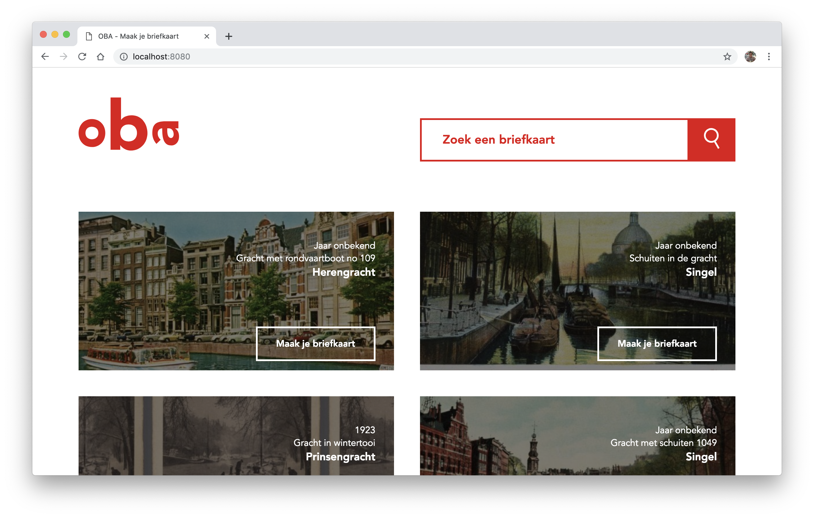

<p align="center">
	<h1 align='center'>Vind een briefkaart in de OBA</h1>
	
</p>
<p align="center">
	De OBA heeft in hun database meer dan 1400 briefkaarten. Zoek een briefkaart uit het verleden en stuur dit op naar een bekende of print hem zelf uit.
</p>
<br>

## Inhoudsopgave

- [Concept](#concept)
- [Download project](#download-project)
- [Nog te doen](#nog-te-doen)
- [Sources](#sources)

## Concept

- Vind een briefkaart uit het verleden wat gedigitaliseerd is
- Voeg de gegevens toe, bijvoorbeeld naar wie het opgestuurd moet worden, een extra bericht, etc.
- Print het uit en verstuur het met de post
- Of verstuur het naar de OBA die het zal opsturen

## Download project

Om dit project te gebruiken, is het belangrijk dat npm geïnstalleerd is.

```shell
# Clone repository
git clone https://github.com/peppequint/project-1-1819.git

# Ga naar de folder
cd web-app-from-scratch-18-19

# Installeer dependencies
npm install
```

## Nog te doen

- [ ] Aantrekkelijk maken van de applicatie
- [ ] Betere loader om duidelijk te maken dat de data wordt opgehaald
- [ ] Meer interactie op de overzichtspagina met de briefkaarten
- [ ] Meer interactie met de briefkaart in plaats van het invullen van een formulier (flippen van de kaart bijv.)
- [ ] Het gebruik van CSS Print onderzoeken en gebruiken
- [ ] 'Terug-knop' naar de overzichtspagina i.c.m. localStorage
- [ ] Meer interactie met 'search bar'

## Sources

- [Maanlamp's OBA wrapper](https://github.com/maanlamp/OBA-wrapper)
